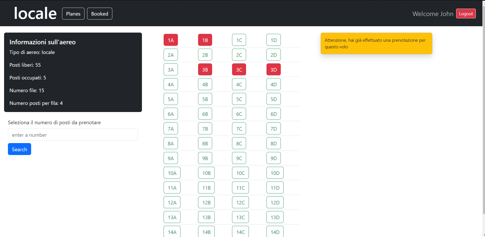

# Exam #12345: "Exam Title"
## Student: s309559 RECCHIA FRANCESCO 

## React Client Application Routes

- Route `/planes`: pagina principale, mostra l'elenco degli aerei esistenti e le relative informazioni
- Route `/planes/:type`: pagina per visualizzare nel dettaglio le informazioni sull'aereo `type` selezionato e dare la possibilità di prenotazione se loggati
- Route `/booked`: pagina per visualizzare le prenotazioni effettuate e cancellarle
- Route `/login`: pagina per fare il login
- Route `*`: per le pagine che non esistono

## API Server

### Autenticazione

- POST `/api/sessions`
  - Description: Richiesta per il login.
  - Request body:
    - oggetto {username,password}
  - Response: `200 OK` (success)
    - Response body:
      - oggetto user {id,username,name}
  - Response: `401 Unauthorized`
    - response body:
      - {"error":"Incorrect username or password"}
- DELETE `/api/sessions/current`
  - Description: Logout
  - Response: `200 OK` (success) : {}
- GET `/api/sessions/current`
  - Description: Verifica se l'utente è loggato.
  - Response: `200 OK` (success)
    - Response body: oggetto user
  - Response: `401 Unauthorized`
    - response body {"error":"Not authenticated"}

### Altre

- GET `/api/planes`
  - Description: Ottiene le informazioni su tutti i tipi di aerei del db. Se riceve il parametro type ritorna le informazioni dell'aereo specifico
  - Response: `200 OK` (success)
    - Response body: lista di oggetti Plane {id,tipo,file,posti,liberi,occupati,totali}
  - Response: `404 Not Found`
    - response body {"error":"No plane found"}

- GET `/api/planes/:type/reservations`
  - Description: Ottiene le prenotazioni effettuate relative a un tipo di aereo e le informazioni su quell'aereo
  - Condizione: Utente loggato
  - Response: `200 OK` (success)
    - Response body: oggetto {info, res}
      - info è un oggetto Plane {id,tipo,file,posti,liberi,occupati,totali}
      - res è una lista di Reservation {id,idPlane,iduser,rowNumber,seatNumber}
  - Response: `404 Not Found`
    - response body {"error":"No plane found"}

- GET `/api/users/reservations`
  - Description: Ottiene tutte le prenotazioni effettuate dall'utente loggato separate per tipologia di aereo
  - Condizione: Utente loggato
  - Response: `200 OK` (success)
    - Response body: oggetto result{planeType:[posto1,posto2],...}
      - posto={row,seat}
      - ritorna un oggetto vuoto {} se l'utente non ha effettuato prenotazioni
  - Response: `404 Not Found`
    - response body {"error":"Plane not found"}

- POST `/api/reservations`
  - Description: Aggiunge una nuova prenotazione. Ogni prenotazione è associata all'utente loggato, a un tipo di aereo e può riguardare più posti. Se la prenotazione ha successo anche le informazioni dell'aereo sono aggiornate. Se esiste già una prenotazione fatta dall'utente per l'aereo specifico, viene annullata
  - Condizione: Utente loggato
  - Response: `200 OK` (success)
    - Response body: oggetto {nuovi,updated}
      - nuovi: numero di posti prenotati
      - updated: numero di righe nella tabella aerei aggiornate
  - Response: `404 Not Found`
    - response body {"error":"No plane found"}
  - Response: `403 Forbidden`
    - response body
      - {"error":"hai già effettuato una prenotazione per questo volo"}
      - {"occupati": [] } ritorno la lista dei posti occupati tra quelli che ho provato a prenotare
  - Response: `400 Bad Request`
    - response body {"error":"non esiste questa fila o questo posto per questo aereo",fila,posto}
  - Response: `500 Internal Server Error`
    - response body {"error":"db no more consistent"}
  - Response: `503 Service Unavailable`
    - response body {"error":"Database error during the creation of new reservation"}

- DELETE `/api/reservations/:type`
  - Description: Cancella tutti i posti prenotati dall'utente per l'aereo di uno specifico tipo
  - Response: `200 OK` (success)
    - Response body: oggetto {deleted,updated}
      - deleted: numero di prenotazioni cancellate dalla tabella
      - updated: numero di righe nella tabella aerei aggiornate
  - Response: `404 Not Found`
    - response body {"error":"Reservation not found"}
  - Response: `500 Internal Server Error`
    - response body {"error":"db no more consistent"}
  - Response: `503 Service Unavailable`
    - response body {"error":"Database error during the delete of reservations for plane ",idPlane}

### Utility, per prove e test

- DELETE `/api/reservations`
  - Description: Cancella tutte le prenotazioni
  - Response: `200 OK` (success)
    - Response body: oggetto {deleted}
      - deleted: numero di prenotazioni cancellate dalla tabella
  - Response: `503 Service Unavailable`
    - response body {"error":"Database error during the deletion"}

- PUT `/api/reservations`
  - Description: resetta i dati di tutti gli aerei segando tutti i posti come liberi
  - Response: `200 OK` (success)
    - Response body: [Planes]
  - Response: `503 Service Unavailable`
    - response body {"error":"Database error during the creation of new reservation"}

## Database Tables

- Table `users` - contains id (primary autoincrement key), email, name, hash, salt
- Table `aerei` - contains id (primary autoincrement key), tipo, file, posti, liberi,occupati,totali
- Table `prenotazioni` - contains id (primary autoincrement key), aereoId, userId, fila, posto
  - il numero della fila parte da 0
  - il posto è indicato come numero che parte da 0
  - le conversioni necessarie alla visualizzazione sono fatte lato Client

## Main React Components

- `MainPage` : rappresenta la pagina iniziale del sito in cui vengono mostarti i 3 tipi di aereo e i relativi dati
- `PlanePage` : vengono visualizzate tutte le informazioni realtive all'aereo specifico e si da la possibilità di prenotare dei posti
  - `PlaneInfo`: Card con dati dell'aereo
  - `PlaneGrid`: Table con la visualizzazione bidimensionale dei posti
  - `BookingForm`: Form per la selezione dei posti
  - `Finalization`: Card con i pulsanti per finalizzare la prenotazione
- `PastReservationsPage` in (`OldReservations.jsx`): ListGroup di prenotazioni del sigolo utente
- `MainHeader`: Navbar principale con informazioni sull'utente loggato e il tipo di aereo
- `LoginForm` in (`Auth.jsx`): Form per il login

## Screenshot

## Users Credentials

- username: john.doe@polito.it, password: password,name: John, id: 1
  - 2 prenotazioni effettuate per aerei(locale,regionale)
- username: mario@polito.it, password: password,name: Mario, id: 2
  - 2 prenotazioni effettuate per aerei(locale,regionale)
- username: test1@polito.it, password: password,name: TestUser, id: 3
- username: test2@polito.it, password: password,name: User4, id: 4
